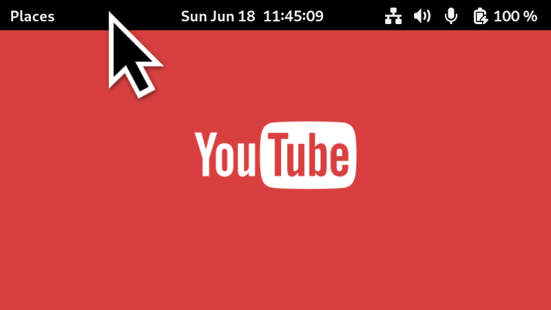

#  Peek Top Bar On Fullscreen (Gnome Extension)

This is a Gnome Shell Extension that enables Gnome top bar (panel) to show up
while you're playing full screen content (like a YouTube video). Just hover the
mouse cursor to the top of the screen, and the top bar will show up. This way,
you can quickly check the time, or swich some toggles.

This is similar to what macOS offers for full screen apps.

On Wayland, to hide the top bar, you need to click the primary mouse button
somewhere outside of the bar. On X11, just take the cursor away from the bar.

## Preview

[peek-topbar-on-fullscreen-preview.webm](https://github.com/marcinjahn/gnome-top-bar-on-fullscreen-extension/assets/10273406/91fb0638-8dcd-421f-8be0-a9457c02cbc7)
